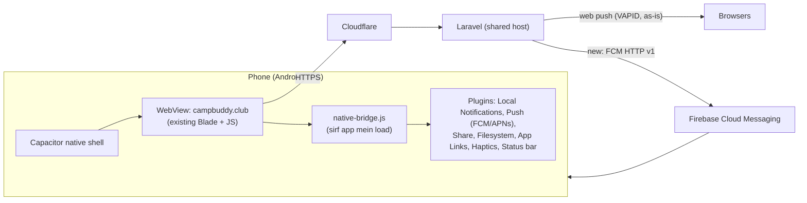

# CampBuddy — Hybrid mobile app plan (Android + iOS)

**Status:** sirf plan. Kuch implement nahi hua. Existing web app ka koi code nahi badla.

---

## 1. App kyun? (GA data se)

| GA data | App kya hal karti hai |
|---|---|
| iPhone users sabse zyada (64 vs Android 54) | — |
| iPhone par reminder ke liye 15 baar "pahale install karo" aaya, sirf 5 ne reminder on kiya | App mein **local notifications** — server nahi, install-trick nahi, iOS par bhi chalti hain |
| Install popup: 22 ko dikha → 7 ne install kiya | Store se install = jaana-pahchana tareeka, "Add to Home Screen" samjhana nahi padta |
| Event ke baad traffic ~0 | App icon phone par rehta hai + native push → agle WordCamp par wapas laana aasan |
| Camp Card download / PDF export browser par fragile | Native share sheet aur file save |
| Safari 7 din use na ho to site ka data mita sakta hai (ITP) | App ka storage nahi mitta → discovery owner token, saved sessions safe |

**Jo app nahi hai:** naya product nahi. Wahi CampBuddy, wahi features, wahi no-login rule. Web (campbuddy.club) chalta rahega — app ek extra darwaza hai.

---

## 2. Approach: kaunsa "hybrid"?

| Option | Kaisa | Faisla |
|---|---|---|
| **Capacitor shell + live website** | Native shell (Android + iOS) jo campbuddy.club ko WebView mein kholta hai, upar native plugins (notifications, share, files, deep links) | ✅ **Recommended** |
| Android TWA (PWABuilder) | Android par sabse sasta, Chrome hi app chalaata hai | ❌ iOS ka hal nahi; iOS ke liye phir bhi Capacitor chahiye — do raste kyun |
| React Native / Flutter rewrite | Poori app dobara native mein | ❌ Do codebase, mahino ka kaam, frozen code ka dobara likhna, server-rendered Blade reuse nahi hota |
| Ionic/Cordova | Capacitor ka purana bhai | ❌ Capacitor hi iska naya version hai |

**Kyun Capacitor:** existing app Laravel + Blade + vanilla JS hai, already mobile-first PWA hai. Capacitor se 90% code wahi rehta hai, ek hi codebase dono stores ke liye, aur web par deploy karte hi app mein bhi update aa jata hai (store release ki zaroorat sirf native hisse ke liye).

### Content kahan se load hoga
**Phase 1: live site (remote URL)** — app `https://campbuddy.club` kholti hai.
- Faayda: har web deploy turant app mein; ek hi data source; CDN/cache rules wahi.
- Dhyan: Capacitor docs `server.url` ko "production ke liye nahi" kehte hain. Isliye:
  - App ke andar ek chhota **bundled offline screen** (no internet → "Internet nahi hai, saved data dikhane ki koshish…" + retry).
  - iOS par service worker ke liye `WKAppBoundDomains` mein `campbuddy.club` daalna zaroori hai, warna offline caching (sw.js) iOS WebView mein nahi chalega.
  - `allowNavigation` sirf `campbuddy.club`; baaki sab links (sponsor site, WordCamp site, LinkedIn) system browser mein khulein.
- **Phase 3 (agar zaroorat ho):** shell bundled HTML + API se data, agar Apple remote-URL wajah se reject kare ya offline aur strong chahiye.

---

## 3. Architecture



**Ek hi web code, do jagah.** Web app ko pata chalega ki wo app ke andar hai (user-agent suffix `CampBuddyApp/1.0 (ios|android)` + `window.Capacitor`). Uske hisaab se:

| Web feature | App ke andar |
|---|---|
| Install popup (`install.js`) | chhupa do |
| iOS "pahale install karo" instruction | chhupa do |
| Desktop notice | lagu nahi |
| Session reminder (Web Push) | **Local notification** (phone khud schedule kare, server nahi) |
| Event/thank-you/upcoming push | **FCM** (Android + iOS dono FCM ke through APNs) |
| Camp Card PNG / PDF download | Filesystem save + native Share sheet |
| Bahar ke links | system browser |
| In-app browser detection | lagu nahi |
| GA `platform` dimension | `app_ios` / `app_android` (naya dimension nahi — 50/50 bhare hain) |

Saara app-specific JS ek nayi file `native-bridge.js` mein — existing modules mein sirf chhote "agar app hai to bridge ko do" hooks. Har hook existing code chhoota hai, isliye frozen-code rule (do popup) lagega.

---

## 4. Features — phase wise

### Phase 1 — MVP (store mein aana)
1. Capacitor shell, splash, app icon (existing `media/icons/`), status bar color.
2. Live site WebView + offline fallback screen + external links system browser mein.
3. **Session reminders = local notifications** (save karte hi schedule, unsave par cancel, 10 min pahale, hall/track ke saath). Permission wahi pahale wale rule se: pahale save ke baad poochna, deny ko hamesha maanna (N1/N4).
4. **Deep links:** `https://campbuddy.club/event/...` (ID-card QR bhi) app installed ho to app mein khule — Android App Links (`/.well-known/assetlinks.json`), iOS Universal Links (`/.well-known/apple-app-site-association`).
5. Camp Card + PDF: save to Photos/Files + Share sheet.
6. Install/iOS-instruction UI app mein chhupana; GA `platform` values.
7. Android back button = page back, home par app band.

### Phase 2 — Retention
1. **Remote push via FCM** — thank-you, upcoming WordCamp, event announcements, discovery mutual wave.
2. Notification tap → seedha sahi page (deep link).
3. App badge (iOS/Android) — "aaj ke saved sessions".
4. Haptics on save / wave (chhota, polish).
5. In-app review prompt (event ke baad, thank-you card ke saath — ek baar).

### Phase 3 — Native polish (data dekh ke)
1. Home screen widget: "Next session in 12 min · Hall B".
2. Add to calendar (native).
3. Bundled shell (agar remote URL mein dikkat aaye).
4. Apple Wallet / Google Wallet pass for Camp Card.

**Bahar hai (scope ke saath):** login/accounts, doosre ka QR scan karke contact list, dark mode — product ke standing faisle, app mein bhi nahi.

---

## 5. Backend changes (sab additive)

| Change | Detail |
|---|---|
| `/.well-known/assetlinks.json`, `/.well-known/apple-app-site-association` | Laravel routes ya static files; Cloudflare par cache OK |
| Push tokens | Naya table `native_push_tokens` (event_id, platform, fcm_token, discovery_id nullable, created/updated) — existing `push_subscriptions` ko chhuna nahi |
| `POST /api/v1/events/{slug}/push/native-subscribe` | naya endpoint, `throttle:api-writes` |
| Sending | Naya `NativePushSender` (FCM HTTP v1, service-account JSON `.env` mein). Existing jobs (`SendThankYouPushJob`, upcoming-push) mein web ke saath native bhi bhejna = existing code change → do popup |
| Data retention | Native tokens bhi wahi retention (`RETENTION_DAYS`) aur event-delete ke saath mitein |
| Admin | Admin → Analytics/Feedback mein platform-wise split (baad mein) |

Shared host par FCM HTTP call cron ke `queue:work` se chalega — koi naya server nahi chahiye. Load: FCM HTTP v1 mein ek request = ek token, isliye 10K users ko push = chhote chunks mein queue jobs + rate limit.

---

## 6. Store ke rules — pahale se tayyari

### Apple (App Store)
- **Guideline 4.2 (minimum functionality):** "sirf website ka wrapper" reject hota hai. Hamara jawab: local notifications, native share/files, deep links, offline screen, push — review notes mein ye clearly likho.
- **1.2 User-generated content:** Discovery mein waves/messages hain → **report + block** option aur abuse contact zaroori. Abhi web mein ye hai ya nahi, implement se pahale check karna hai. Ye MVP blocker hai.
- **5.1.1:** no login — accha; account deletion rule lagu nahi. Par "Leave discovery / delete my data" (DP3) app mein aasaani se dikhe.
- **Privacy nutrition label:** GA (analytics, not linked to identity), discovery name/interests (user-provided, public roster se), push token.
- Privacy policy URL: existing `/privacy`.
- Review mein 1–3 din; event se kam se kam **2 hafte pahale** submit.

### Google Play
- **Personal developer account (Nov 2023 ke baad bana):** production se pahale **12 testers × 14 din closed testing** zaroori. Organization account (D-U-N-S number) par ye shart nahi. → Faisla jaldi lena hai, ye timeline ka sabse lamba hissa hai.
- Data safety form (Apple label jaisa).
- Target API level latest (Play har saal badhata hai).

### Kharcha
| Item | Cost |
|---|---|
| Apple Developer Program | $99 / saal |
| Google Play Console | $25 ek baar |
| Firebase (FCM) | free |
| iOS build ke liye Mac | Windows par ho to: cloud build (Codemagic free tier / GitHub Actions macOS runner) ya kiraye ka Mac |

---

## 7. Folder structure (jab bana ayenge)

```
mobile-app/
  README.md                   ← ye plan ka index
  01-ga-report-improvements.md
  02-hybrid-app-plan.md
  app/                        ← (future) Capacitor project
    capacitor.config.ts       appId: club.campbuddy.app, server.url, allowNavigation
    www/                      offline fallback screen (bundled)
    android/                  Android Studio project
    ios/                      Xcode project
    store/                    screenshots, descriptions (EN + HI), privacy answers
```
Web repo mein naya: `resources/js/attendee/native-bridge.js`, `.well-known` routes, `native_push_tokens` migration, `NativePushSender`.

`mobile-app/app` ko alag git repo rakhna hai ya isi repo mein — open decision (neeche).

---

## 8. Testing

- Existing test suite (PHP + `npm run test:js` + browser) green rehna chahiye — web behaviour same.
- Naye tests: native-subscribe endpoint, token retention/delete, `native-bridge.js` ka "app nahi hai to kuch mat karo" path (web par zero badlaav ka saboot).
- Real devices: kam se kam 1 purana Android (Android 9–10, sasta phone — Xiaomi/OPPO/Vivo GA mein dikhe), 1 naya Android, 1 iPhone (iOS 16), 1 iPhone latest.
- Checklist: offline → online, deep link from QR (app installed / not installed), reminder phone lock par, deny permission → kabhi dobara prompt nahi, device transfer, Camp Card share.
- Event se pahale **ek chhoti WordCamp/meetup par soft launch**.

---

## 9. Timeline (andaaza)

| Hafta | Kaam |
|---|---|
| 0 | Faisle (neeche), Apple + Google accounts, Firebase project |
| 1 | Capacitor shell, deep links, offline screen, external links |
| 2 | Local notifications, Camp Card share/save, install UI hide, GA platform |
| 3 | UGC report/block (agar missing), store listing, privacy forms; Android closed testing shuru (14 din ka timer) |
| 4–5 | Device testing, fixes; iOS TestFlight beta |
| 5–6 | Store submit → live. Phase 2 (FCM) shuru |

**Target:** India ke agle bade WordCamp se kam se kam 3 hafte pahale dono stores mein live. Uske baad ka event app ka pahala asli test.

---

## 10. Risks

| Risk | Asar | Bachaav |
|---|---|---|
| Apple 4.2 reject ("sirf website") | iOS late | native features pahale din se, review notes saaf; zaroorat ho to Phase 3 bundled shell |
| Play 14-din testing | Android late | organization account, ya testing turant shuru |
| Web change app ko tod de | app users par bug | `native-bridge.js` alag; app UA par ek smoke test har deploy se pahale |
| Do push system (web + FCM) | double notification | ek device = ek channel; app mein web push register hi mat karo |
| Shared host par push load | slow queue | chunked jobs; better server plan (owner ka goal) |
| iOS WebView mein service worker | offline kam | `WKAppBoundDomains` + test |

---

## 11. Owner ke faisle (implement se pahale)

1. **Google Play account:** personal (12 testers × 14 din) ya organization (D-U-N-S, testing shart nahi)? — *Recommendation: organization, agar company/entity hai.*
2. **iOS build:** Mac hai ya cloud build (Codemagic)? — *Recommendation: Codemagic free tier se shuru.*
3. **App name / ID:** "CampBuddy" + `club.campbuddy.app`?
4. **Code kahan:** `mobile-app/app` isi repo mein ya alag repo (jaise marketing)? — *Recommendation: alag repo, web repo saaf rahe.*
5. **Phase 1 mein FCM bhi chahiye** ya pahale sirf local notifications? — *Recommendation: pahale local; FCM Phase 2.*
6. Discovery mein report/block — abhi web mein kya hai, check karke Apple ke liye kya add karna hai.
